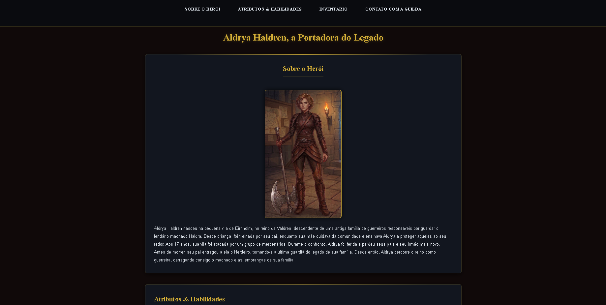

    # 📁 Portfólio Pessoal - Front-End 

Este é meu projeto final desenvolvido durante o curso **Tecnologia Web - Engenharia da Computação (Front-End)**. Trata-se de um site de uma ficha de personagem de RPG, e formas de contato.

---

## 📌 Sobre o Projeto

Este site foi criado com foco em aplicar os conhecimentos de **HTML**, **CSS**,, **Flexbox**, **responsividade** e **publicação com GitHub Pages**.

---
## Funcionalidades

O projeto foi estruturado para exibir:
**Sobre o Herói**- Dados da trajetória e imagem de destaque;
**Atributos & Habilidades**- Barra de progresso e lista de habilidades;
**Inventário**- Organização dos itens em grade de nível de raridade e descrição;
**Contato com a Guilda**- Links úteis para interação;

---
## 🧰 Tecnologias Utilizadas

- HTML5 (Estruturação semântica)
- CSS3 + Flexbox
- Google Fonts (Fontes Cinzel e Inter)
- Font Awesome
- Git + GitHub
- GitHub Pages (para publicação)

---

## 🎨 Protótipo (Figma)

Link para o protótipo criado no Figma:  
[🔗 Ver protótipo](https://www.figma.com/design/jIy6e6gWivksjRAkSvm1Fk/Sem-t%C3%ADtulo?node-id=0-1&t=I0yG4yKhEyZeGl66-1)

---

## 🔗 Acesso ao Projeto

- **GitHub Pages:** [Clique aqui para acessar o site]( https://gabriela-bomfim.github.io/RPG-ficha/)
- **Repositório GitHub:** [Acesse o código-fonte aqui](https://github.com/Gabriela-Bomfim/RPG-ficha)
---

## 📸 Capturas de Tela

> 

---

## 📄 Licença

Este projeto é de uso educacional, criado como parte da disciplina **Tecnologia Web**.

---

## 🙋‍♀️ Desenvolvido por

**Gabriela Oliveira RA:267912**  
Turma: [Engenharia da computação 2 semestre]  
Email: [gabitbomfim@gmail.com]  
GitHub: [https://github.com/seuusuario](https://github.com/seuusuario)
